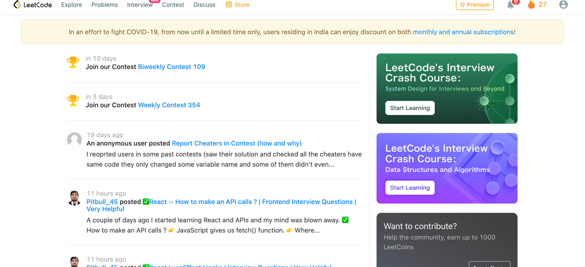

# _Leetcode-Scrapper_

<!-- PROJECT LOGO -->

  
  <h3 align="center">README-FILE</h3>
  

     
    <a href="https://medium.com/@runitranjankumar/leetcode-automate-solving-problems-4f6dfa35f2fd"><strong>Go to medium»</strong></a>
     
     
    <a href="https://youtu.be/yl3zF6ZVpDg">View Demo</a>
    ·
    <a href="https://github.com/runitrupam/leetcode-automate.git">Report Bug</a>
    
  

<!-- TABLE OF CONTENTS -->

  
Table of Contents

  <ol>
    <li>
      <a href="#about-the-project">About The Project</a>
      <ul>
        <li><a href="#built-with">Built With</a></li>
      </ul>
    </li>
    <li>
      <a href="#getting-started">Getting Started</a>
      <ul>
        <li><a href="#prerequisites">Prerequisites</a></li>
        <li><a href="#installation">Installation</a></li>
      </ul>
    </li>
    <li><a href="#Roadmap">Roadmap</a></li>
    <li><a href="#usage">Usage</a></li>
    <li><a href="#contributing">Contributing</a></li>
    <li><a href="#acknowledgments">Acknowledgments</a></li>
  </ol>

<!-- ABOUT THE PROJECT -->
## About The Project

##### This is web scraping program to download all your Leetcode solved problems. And Automate the leetcode daily solution

(<a href="#readme-top">back to top</a>)

### Built With

* [![Selenium][selenium.se]][selenium-url]
* [![Python][Python.py]][Python-url]

(<a href="#readme-top">back to top</a>)

<!-- GETTING STARTED -->
## Getting Started

 

1. #### Scrape the leetcode solution
    - [X] Login
    - [X] store problems solved links in a leetcode_solved_links.json
    - [X] Read from leetcode_solved_links.json to check if the solution exists or not.
    - [X] Get the solutions and add to the directory leet_code_solutions,
      with their respective extension .py , .js or .cpp.
2. #### Automate the leetcode daily solution.
    - [X] Automatic Login(Pick creds from .env
    - [X] get all language specific solutions and try all solutions until Run code is correct.
    - [X] Submit and save the solution to the directory leet_code_daily_solutions,
      with their respective extension .py , .js or .cpp. .
    - [X] Create a cron to run daily
 

###### Prerequisites

You just need 2 things.  
* Check your Chrome browser version and download suitable chromedriver.
* All the code files

###### Installation

**1. source new_venv/bin/activate**

**2. pip3 install -r requirements.txt**

(<a href="#readme-top">back to top</a>)

## Roadmap
1. Run the leetcode_scraper.py file
1. Required directory/files will be created during runtime. Go through the comments in the codes. 
2. Already created file of the problem won't be scrapped again
3. Create Cron job to run the automation daily.
4. Sit tight while your daily problem is solved automatically.

(<a href="#readme-top">back to top</a>)

<!-- USAGE EXAMPLES -->
## Usage
* Automate solving of daily leetcode solution.
* Get all solved problems.

<!-- CONTRIBUTING -->
## Contributing

You can run the "leetcode_scrapper.py" directly.
 
Follow the on-screen instruction.
You will be asked for your login credentials. 
 

Since Leetcode website gets updated after few months of interval, you might face WebDriver Errors. Please do not
hesitate to raise an issue with error screenshot. This will help me to update the codebase in efficient manner.
 
 

Watch automation on browser, it is fun :)  
 

Share this with your friends! Happy Leetcoding!!  

1. Fork the Project
2. Create your Feature Branch (`git checkout -b leetcode-automate/AmazingFeature`)
3. Commit your Changes (`git commit -m 'Add some AmazingFeature'`)
4. Push to the Branch (`git push origin leetcode-automate/AmazingFeature`)
5. Open a Pull Request

(<a href="#readme-top">back to top</a>)

<!-- ACKNOWLEDGMENTS -->
## Acknowledgments
1. https://pypi.org/project/python-leetcode/
2. https://selenium-python.readthedocs.io/
3. https://medium.com/@runitranjankumar/unpivot-a-pivot-table-of-python-b2a920008628
4. https://medium.com/@runitranjankumar/leetcode-automate-solving-problems-4f6dfa35f2fd  

(<a href="#readme-top">back to top</a>)

<!-- MARKDOWN LINKS & IMAGES -->
<!-- https://www.markdownguide.org/basic-syntax/#reference-style-links -->

[selenium.se]: https://encrypted-tbn0.gstatic.com/images?q=tbn:ANd9GcTFv94DfH92e1acEimJIRFpUHfKems3vH2CgsxdQVk&s 
[selenium-url]: https://pypi.org/project/selenium/
[Python.py]: https://encrypted-tbn0.gstatic.com/images?q=tbn:ANd9GcSRqZrom6I5rsEUjnjffFQCw-ujBQEcu2e6LWyOK0KieA&s
[Python-url]: https://docs.python.org/3/

